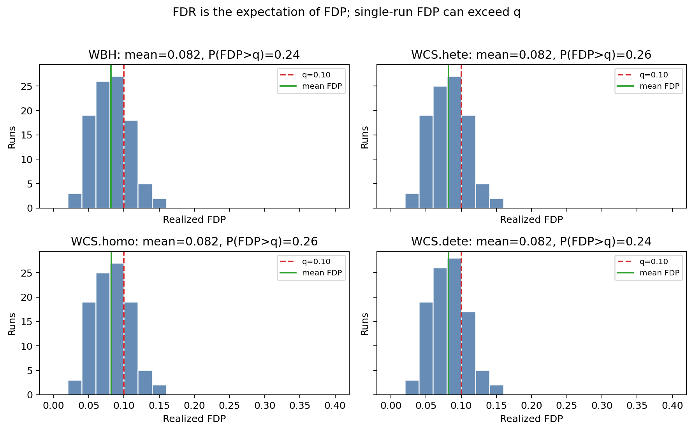

# FDR 控制的是期望比例，而不是每一次实验的 FDP 上界

## 1. 汇报目的

本次 simulation 的目标是说明一个容易混淆但非常重要的概念：

> FDR 控制的是重复实验意义下的期望错误发现比例，即 `FDR = E[FDP]`，而不是保证每一次实验中的 realized FDP 都不超过名义水平 `q`。

换句话说，如果一个方法在 `q = 0.1` 下控制 FDR，并不意味着每一次实验的 FDP 都一定小于等于 `0.1`。它意味着在相同数据生成机制下重复实验多次，FDP 的平均值应当不超过或接近名义水平。

这个现象在选择推断和多重检验问题中尤其重要。论文中的 Weighted Conformalized Selection 目标是控制 FDR，而 FDR 本身就是一个期望量。

## 2. 背景概念

记：

- `R`：算法选择出的样本数量，也就是发现数。
- `V`：选择出的样本中实际为 false discovery 的数量。
- `FDP`：一次实验中的错误发现比例。

定义为：

```text
FDP = V / max(R, 1)
```

而 FDR 是 FDP 的期望：

```text
FDR = E[FDP]
```

这里的期望来自实验随机性，包括数据生成、训练样本、校准样本、测试样本，以及算法内部可能引入的随机化。

因此：

- FDP 是单次实验中的随机变量。
- FDR 是 FDP 在重复实验中的平均水平。
- 控制 FDR 不等价于逐次控制 FDP。

## 3. Simulation 设定

本实验基于已复现论文代码中的 outlier detection simulation。

使用路径：

```text
reference/conformal-selection/experiments/outlier_detection/simulations
```

我们固定一个配置：

```text
sig_id = 4
out_prop_id = 2
q = 0.1
seed = 1, 2, ..., 100
```

其中：

- `sig_id = 4` 对应文件名中的 `sig4`，在结果表中对应信号强度约 `2.5`。
- `out_prop_id = 2` 对应 outlier proportion 为 `0.2`。
- `q = 0.1` 是名义 FDR 控制水平。
- 100 个 seed 表示同一 setting 下重复 100 次实验。

比较的方法包括：

- `WBH`
- `WCS.hete`
- `WCS.homo`
- `WCS.dete`

这些方法均来自论文相关代码。我们关注每个 seed 下的 realized FDP，并统计其均值和超过 `q` 的概率。

## 4. 实验结果

100 次重复实验的汇总如下：

| method | runs | mean FDP | sd FDP | median FDP | 90% quantile | max FDP | P(FDP > q) | mean power | mean nsel |
|---|---:|---:|---:|---:|---:|---:|---:|---:|---:|
| WBH | 100 | 0.0819 | 0.0252 | 0.0820 | 0.1135 | 0.1441 | 0.24 | 0.9753 | 212.63 |
| WCS.hete | 100 | 0.0821 | 0.0252 | 0.0820 | 0.1131 | 0.1429 | 0.26 | 0.9753 | 212.69 |
| WCS.homo | 100 | 0.0821 | 0.0252 | 0.0820 | 0.1131 | 0.1429 | 0.26 | 0.9753 | 212.69 |
| WCS.dete | 100 | 0.0819 | 0.0251 | 0.0820 | 0.1131 | 0.1429 | 0.24 | 0.9753 | 212.63 |

关键观察：

1. 所有方法的平均 FDP 约为 `0.082`，低于名义水平 `q = 0.1`。
2. 但是，单次实验中 FDP 超过 `0.1` 的比例并不低：
   - `WBH`: 24%
   - `WCS.hete`: 26%
   - `WCS.homo`: 26%
   - `WCS.dete`: 24%
3. 最大单次 FDP 约为 `0.143` 到 `0.144`，明显高于 `0.1`。

这正好说明：

> FDR 控制允许某些单次实验 FDP 超过 q，只要重复实验平均意义下的 FDP 受到控制。

## 5. 图示解读

下图展示了 100 次重复实验中 realized FDP 的分布。



图中：

- 红色虚线表示名义水平 `q = 0.1`。
- 绿色实线表示 100 次实验的平均 FDP。
- 直方图表示不同 seed 下 realized FDP 的分布。

可以看到：

- 绿色均值线位于红色 `q=0.1` 线左侧，说明平均 FDP 小于 q。
- 但仍有一部分柱子位于红线右侧，说明部分单次实验的 FDP 超过了 q。

这就是 FDR 与 FDP 的核心区别。

## 6. 为什么这不违反 FDR 控制

FDR 控制声明的是：

```text
E[FDP] <= q
```

而不是：

```text
P(FDP <= q) = 1
```

更不是：

```text
每一次实验 FDP 都小于等于 q
```

在本实验中，`WCS.hete` 的平均 FDP 为 `0.0821`，小于 `0.1`。因此从 FDR 的角度看，它满足“平均错误发现比例受控”的直觉。

但因为 FDP 是随机变量，单次实验可能出现：

```text
FDP = 0.11, 0.12, 0.14
```

这些值超过了 `q=0.1`，但并不自动说明 FDR 控制失败。判断 FDR 是否受控，应看重复实验下 FDP 的平均值，而不是单次 realization。

## 7. 对论文方法理解的总结

论文中的方法强调 model-free selective inference，并通过 weighted conformal p-values 和 Weighted Conformalized Selection 在 covariate shift 下控制 FDR。

本 simulation 帮助理解：

1. 论文中的 FDR 是重复实验意义下的误发现率控制。
2. WCS 的保证不是“每次 FDP 都低于 q”。
3. 单次实验的 FDP 可能超过 q，这种现象与 FDR 控制并不矛盾。
4. 评估 FDR 控制时，应进行多次重复实验并观察平均 FDP。

因此，在汇报或解释实验结果时，如果看到某一次实验 FDP 超过名义水平，不应直接判断方法失效；需要进一步看多次重复下的平均 FDP。

## 8. 可复现命令

生成本报告使用的结果：

```powershell
.\.venv\Scripts\python.exe scripts\fdr_vs_fdp_demo.py --sig-id 4 --out-prop-id 2 --q 0.1
```

输出目录：

```text
outputs/fdr_vs_fdp_demo
```

主要输出文件：

```text
summary.csv
selected_runs.csv
fdp_histograms.png
README.md
FDR_FDP_report.md
```

## 9. 汇报时可使用的简短表述

本 simulation 固定一个 outlier detection setting，并重复 100 个随机种子。结果显示，在 `q=0.1` 下，WCS 和 WBH 的平均 FDP 约为 `0.082`，低于名义水平，因此从 FDR 即 `E[FDP]` 的角度看是受控的。然而，约 `24%` 到 `26%` 的单次实验 FDP 超过了 `0.1`，最大单次 FDP 约为 `0.144`。这说明 FDR 控制的是重复实验中的期望错误发现比例，而不是保证每一次实验中的 FDP 都低于 q。

