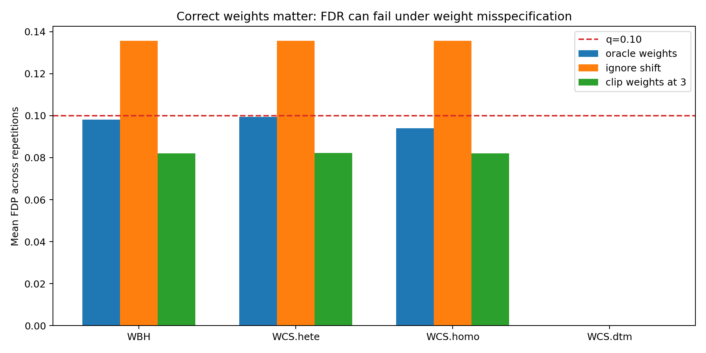
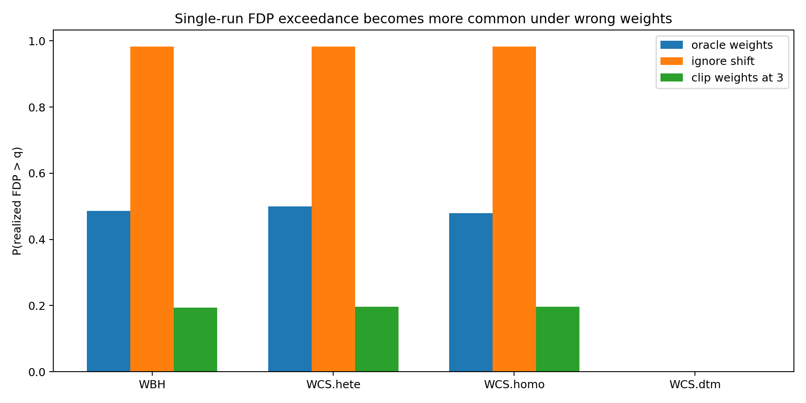

# 针对论文潜在缺点的 simulation：权重错设会破坏 FDR 控制

## 1. 汇报目的

前一个 simulation 说明了：

> FDR 控制的是 `E[FDP]`，而不是保证每一次实验中的 FDP 都低于 `q`。

本次 simulation 进一步针对论文方法的一个潜在缺点：

> Weighted Conformalized Selection 在 covariate shift 下的有限样本 FDR 控制依赖正确的 density-ratio weights。如果权重被忽略、估计错误或处理不当，FDR 控制可能被破坏。

这比单纯复现论文结果更能体现对论文的理解：论文方法虽然是 model-free 的，但并不是 assumption-free 的。它不要求 outcome model 正确，却要求 covariate-shift adjustment 使用的权重能够正确反映 calibration distribution 与 test distribution 的差异。

## 2. 论文方法中的关键点

论文考虑 calibration data 与 test data 存在 covariate shift：

```text
X_cal ~ P_X
X_test ~ Q_X
```

为了在这种分布偏移下构造有效的 weighted conformal p-values，需要使用 density ratio：

```text
w(x) = dQ_X(x) / dP_X(x)
```

直观地说：

- calibration set 来自 `P_X`；
- test set 来自 `Q_X`；
- 如果直接把 calibration set 当成 test distribution 的代表，会产生偏差；
- 权重 `w(x)` 用来把 calibration distribution 重新加权成 test distribution。

因此，方法的优点是：

> 可以使用任意预测模型，并在正确 covariate-shift 权重下控制 FDR。

但潜在缺点是：

> 如果权重错误，weighted conformal p-values 可能不再校准，FDR 控制可能失败。

## 3. Simulation 设计

我们构造一个非常简单但能暴露问题的二分类选择任务。

### 3.1 Covariate shift

设 covariate 是一维变量 `X`。

Calibration distribution:

```text
X_cal ~ N(0, 1)
```

Test distribution:

```text
X_test ~ N(delta, 1)
```

本实验中：

```text
delta = 1.5
```

因此 test set 整体向更大的 `X` 区域平移。

### 3.2 Outcome model

给定 `X` 后，二分类响应满足：

```text
Y | X ~ Bernoulli(sigmoid(beta0 + beta1 X))
```

本实验中：

```text
beta0 = -1.0
beta1 = 2.0
```

因此 `X` 越大，`Y=1` 的概率越高。由于 test set 的 `X` 更大，test set 中 positive rate 明显高于 calibration set。

实际模拟中平均：

```text
calibration positive rate ≈ 0.353
test positive rate ≈ 0.776
```

这制造了一个很典型的 covariate shift 场景：测试样本集中在高预测概率区域。

### 3.3 Selection task

目标是从 test set 中选择 `Y=1` 的样本。

False discovery 定义为：

```text
被选中但实际 Y=0
```

我们比较三种权重处理方式：

1. `oracle weights`
   使用真实 density ratio。

2. `ignore shift`
   忽略 covariate shift，所有权重设为 1。

3. `clip weights at 3`
   使用真实权重，但把权重截断到 3。

真实 density ratio 为：

```text
w(x) = exp(delta * x - delta^2 / 2)
```

### 3.4 重复实验

参数：

```text
q = 0.1
n_cal = 800
n_test = 500
repetitions = 300
```

比较方法：

- `WBH`
- `WCS.hete`
- `WCS.homo`
- `WCS.dtm`

其中 `WCS.hete`、`WCS.homo`、`WCS.dtm` 分别对应论文中的不同 pruning 策略。

## 4. 实验结果

| weights | method | runs | mean FDP | sd FDP | P(FDP > q) | mean power | mean nsel |
|---|---:|---:|---:|---:|---:|---:|---:|
| oracle weights | WBH | 300 | 0.0981 | 0.0309 | 0.4867 | 0.8328 | 360.16 |
| oracle weights | WCS.hete | 300 | 0.0995 | 0.0386 | 0.5000 | 0.6413 | 278.22 |
| oracle weights | WCS.homo | 300 | 0.0940 | 0.0363 | 0.4800 | 0.7964 | 344.51 |
| oracle weights | WCS.dtm | 300 | 0.0000 | 0.0000 | 0.0000 | 0.0000 | 0.00 |
| ignore shift | WBH | 300 | 0.1357 | 0.0181 | 0.9833 | 0.9438 | 423.87 |
| ignore shift | WCS.hete | 300 | 0.1357 | 0.0182 | 0.9833 | 0.9437 | 423.84 |
| ignore shift | WCS.homo | 300 | 0.1356 | 0.0181 | 0.9833 | 0.9437 | 423.79 |
| ignore shift | WCS.dtm | 300 | 0.0000 | 0.0000 | 0.0000 | 0.0000 | 0.00 |
| clip weights at 3 | WBH | 300 | 0.0821 | 0.0211 | 0.1933 | 0.8131 | 344.23 |
| clip weights at 3 | WCS.hete | 300 | 0.0822 | 0.0212 | 0.1967 | 0.8128 | 344.13 |
| clip weights at 3 | WCS.homo | 300 | 0.0821 | 0.0212 | 0.1967 | 0.8130 | 344.20 |
| clip weights at 3 | WCS.dtm | 300 | 0.0000 | 0.0000 | 0.0000 | 0.0000 | 0.00 |

## 5. 图示结果

### 5.1 平均 FDP



红色虚线是名义 FDR 水平 `q=0.1`。

可以看到：

- 使用 `oracle weights` 时，`WBH`、`WCS.hete`、`WCS.homo` 的 mean FDP 大约在 `0.094` 到 `0.099`，接近但不超过 `q=0.1`。
- 忽略 covariate shift 时，mean FDP 上升到约 `0.136`，明显超过 `q=0.1`。
- 权重截断在这个 setting 下比较保守，mean FDP 降到约 `0.082`，但 power 也略有下降。

### 5.2 单次 FDP 超过 q 的概率



该图展示 `P(FDP > q)`。

注意，这里即使 oracle weights 下 `P(FDP > q)` 也接近 0.5，这并不矛盾，因为 FDR 控制的是平均 FDP，而不是每一次 FDP。

更关键的是：

- 忽略 shift 后，`P(FDP > q)` 接近 `0.983`。
- 这说明几乎每次实验 FDP 都超过 q。
- 同时 mean FDP 也超过 q，因此这不仅是单次波动，而是 FDR 层面的失控。

## 6. 对论文潜在缺点的理解

这个 simulation 说明，论文方法的核心并不是“只要用了 conformal p-value 就自动安全”。

更准确地说：

> 在 covariate shift 下，weighted conformal p-values 的有效性依赖于权重能正确描述 `P_X` 到 `Q_X` 的变化。

如果权重正确：

```text
mean FDP ≈ 0.094 - 0.099 <= 0.1
```

如果忽略 shift：

```text
mean FDP ≈ 0.136 > 0.1
```

这说明错误权重会让 calibration distribution 无法代表 test distribution，从而造成 p-value 过于乐观，最终带来过多 false discoveries。

因此，对论文方法可以提出一个合理的 caveat：

> 方法对 outcome model 是 model-free 的，但对 covariate-shift weights 并不是免疫的。实践中如果 density ratio 估计不准、权重模型错设、或者权重被不恰当地截断，FDR 控制可能变差。

## 7. 为什么这体现对论文的理解

这个 simulation 不是简单重复论文中的“方法有效”结果，而是针对论文理论保证的边界条件做压力测试。

它体现了以下理解：

1. WCS 的 FDR 控制依赖 weighted conformal p-values 的校准性。
2. weighted conformal p-values 的校准性依赖 density-ratio weights。
3. 论文的 model-free 主要是指 outcome model 不需要正确指定。
4. 但 covariate shift 的权重仍然是关键输入。
5. 错误权重会导致 FDR 从期望意义上失控，而不只是单次 FDP 偶然超过 q。

## 8. 可复现命令

运行 simulation：

```powershell
.\.venv\Scripts\python.exe scripts\weight_misspecification_demo.py `
  --reps 300 `
  --n-cal 800 `
  --n-test 500 `
  --delta 1.5 `
  --beta0 -1.0 `
  --beta1 2.0 `
  --q 0.1 `
  --clip 3
```

输出目录：

```text
outputs/weight_misspecification_demo
```

主要输出：

```text
raw_results.csv
summary.csv
mean_fdp_by_weighting.png
fdp_exceedance_by_weighting.png
README.md
weight_misspecification_report.md
```

## 9. 汇报时可以使用的简短表述

我们设计了一个一维 covariate shift simulation 来检验论文方法的边界条件。Calibration covariates 来自 `N(0,1)`，test covariates 来自 `N(1.5,1)`，且 `Y=1` 的概率随 `X` 增大。因此 test set 集中在更高风险区域。结果显示，使用真实 density-ratio weights 时，WCS 的 mean FDP 约为 `0.094-0.099`，接近且不超过 `q=0.1`；但如果忽略 covariate shift，把所有权重设为 1，mean FDP 上升到约 `0.136`，明显超过 `q=0.1`。这说明论文方法虽然对 outcome model 是 model-free 的，但仍依赖正确的 covariate-shift weights；权重错设是实践中的一个重要潜在风险。

